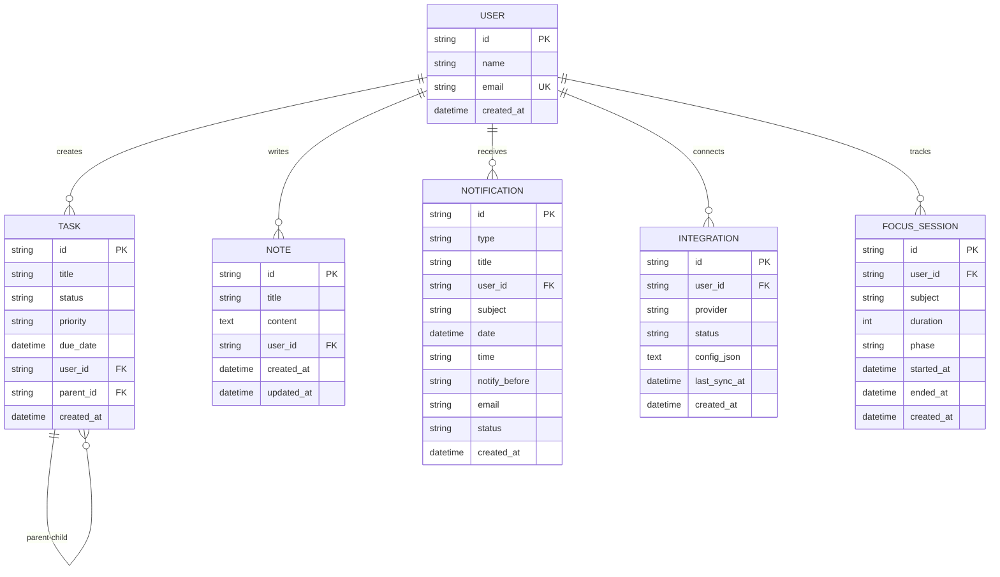

# Entity Relationship Diagram - NexaProductivity

## Entity Descriptions

### USER
Core entity representing a user of the platform. Each user can have multiple tasks, notes, notifications, integrations, and focus sessions.

### TASK
Represents a task or assignment. Supports hierarchical structure through self-referencing parent_id. Status can be pending, in-progress, or completed. Priority levels are low, medium, or high.

### NOTE
Stores user notes with title and content. Tracks creation and update timestamps for revision tracking.

### NOTIFICATION
Manages reminders for tasks and custom events. Supports email notifications with configurable notify-before intervals (e.g., "1 day", "2 hours").

### INTEGRATION
Tracks external service connections (Slack, Outlook). Stores provider-specific configuration as JSON and tracks last sync timestamp.

### FOCUS_SESSION
Records Pomodoro-style focus sessions. Tracks subject studied, duration in minutes, phase (work/break), and session timestamps for analytics.

## Relationships

- One USER can have many TASKS (1:N)
- One USER can have many NOTES (1:N)
- One USER can have many NOTIFICATIONS (1:N)
- One USER can have many INTEGRATIONS (1:N)
- One USER can have many FOCUS_SESSIONS (1:N)
- One TASK can have many child TASKS (1:N self-referencing)

## Cascade Behavior

All child entities (TASK, NOTE, NOTIFICATION, INTEGRATION, FOCUS_SESSION) are configured with CASCADE delete, meaning when a USER is deleted, all associated records are automatically removed.
