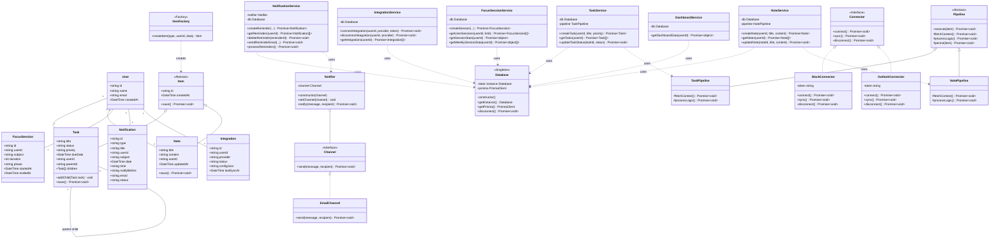

# Class Diagram - NexaProductivity

```mermaid
classDiagram
    %% Core Entities
    class User {
        +string id
        +string name
        +string email
        +DateTime createdAt
    }

    class Item {
        <<Abstract>>
        +string id
        +DateTime createdAt
        +save() Promise~void~
    }

    class Task {
        +string title
        +string status
        +string priority
        +DateTime dueDate
        +string userId
        +string parentId
        +Task[] children
        +addChild(Task task) void
        +save() Promise~void~
    }

    class Note {
        +string title
        +string content
        +string userId
        +DateTime updatedAt
        +save() Promise~void~
    }

    class FocusSession {
        +string id
        +string userId
        +string subject
        +int duration
        +string phase
        +DateTime startedAt
        +DateTime endedAt
    }

    class Notification {
        +string id
        +string type
        +string title
        +string userId
        +string subject
        +DateTime date
        +string time
        +string notifyBefore
        +string email
        +string status
    }

    class Integration {
        +string id
        +string userId
        +string provider
        +string status
        +string configJson
        +DateTime lastSyncAt
    }

    Item <|-- Task
    Item <|-- Note

    %% Creational Patterns
    class ItemFactory {
        <<Factory>>
        +createItem(type, userId, data) Item
    }

    class Database {
        <<Singleton>>
        -static instance Database
        +prisma PrismaClient
        -constructor()
        +getInstance() Database
        +getPrisma() PrismaClient
        +disconnect() Promise~void~
    }

    %% Behavioral Patterns - Strategy
    class Channel {
        <<Interface>>
        +send(message, recipient) Promise~void~
    }

    class EmailChannel {
        +send(message, recipient) Promise~void~
    }

    class Notifier {
        -channel Channel
        +constructor(channel)
        +setChannel(channel) void
        +notify(message, recipient) Promise~void~
    }

    Channel <|.. EmailChannel
    Notifier o-- Channel

    %% Structural Patterns - Adapter
    class Connector {
        <<Interface>>
        +connect() Promise~void~
        +sync() Promise~void~
        +disconnect() Promise~void~
    }

    class SlackConnector {
        -token string
        +connect() Promise~void~
        +sync() Promise~void~
        +disconnect() Promise~void~
    }

    class OutlookConnector {
        -token string
        +connect() Promise~void~
        +sync() Promise~void~
        +disconnect() Promise~void~
    }

    Connector <|.. SlackConnector
    Connector <|.. OutlookConnector

    %% Behavioral Patterns - Template Method
    class Pipeline {
        <<Abstract>>
        +execute(item) Promise~void~
        #fetchContext() Promise~void~
        #processLogic() Promise~void~
        #persist(item) Promise~void~
    }

    class TaskPipeline {
        #fetchContext() Promise~void~
        #processLogic() Promise~void~
    }

    class NotePipeline {
        #fetchContext() Promise~void~
        #processLogic() Promise~void~
    }

    Pipeline <|-- TaskPipeline
    Pipeline <|-- NotePipeline

    %% Service Layer
    class TaskService {
        -db Database
        -pipeline TaskPipeline
        +createTask(userId, title, priority) Promise~Task~
        +getTasks(userId) Promise~Task[]~
        +updateTaskStatus(taskId, status) Promise~void~
    }

    class NoteService {
        -db Database
        -pipeline NotePipeline
        +createNote(userId, title, content) Promise~Note~
        +getNotes(userId) Promise~Note[]~
        +updateNote(noteId, title, content) Promise~void~
    }

    class NotificationService {
        -notifier Notifier
        -db Database
        +createReminder(...) Promise~Notification~
        +getReminders(userId) Promise~Notification[]~
        +deleteReminder(reminderId) Promise~void~
        +sendReminderEmail(...) Promise~void~
        +processReminders() Promise~void~
    }

    class IntegrationService {
        -db Database
        +connectIntegration(userId, provider, token) Promise~void~
        +disconnectIntegration(userId, provider) Promise~void~
        +getIntegrations(userId) Promise~Integration[]~
    }

    class FocusSessionService {
        -db Database
        +createSession(...) Promise~FocusSession~
        +getUserSessions(userId, limit) Promise~FocusSession[]~
        +getSessionStats(userId) Promise~object~
        +getWeeklySessionData(userId) Promise~object[]~
    }

    class DashboardService {
        -db Database
        +getDashboardData(userId) Promise~object~
    }

    %% Relationships
    User "1" -- "n" Task
    User "1" -- "n" Note
    User "1" -- "n" FocusSession
    User "1" -- "n" Notification
    User "1" -- "n" Integration
    Task "1" -- "n" Task : parent-child
    
    ItemFactory ..> Item : creates
    TaskService ..> Database : uses
    NoteService ..> Database : uses
    NotificationService ..> Database : uses
    NotificationService ..> Notifier : uses
    IntegrationService ..> Database : uses
    FocusSessionService ..> Database : uses
    DashboardService ..> Database : uses
    
    TaskService ..> TaskPipeline : uses
    NoteService ..> NotePipeline : uses
```
