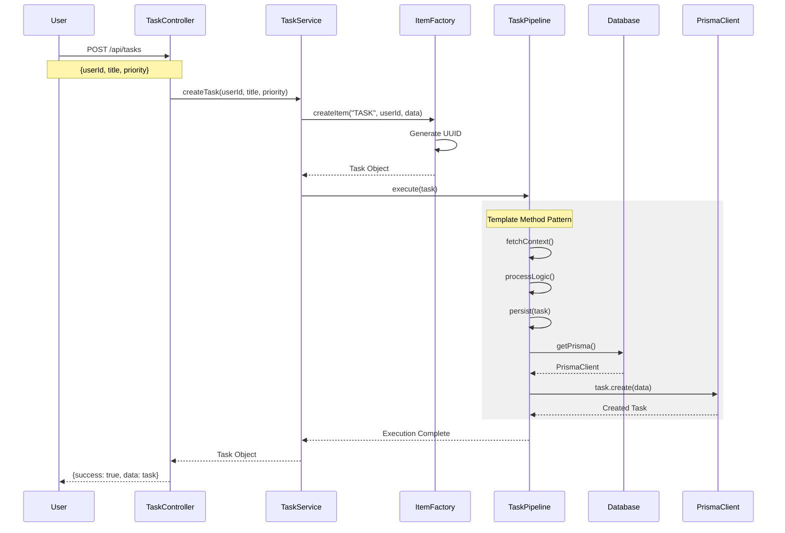
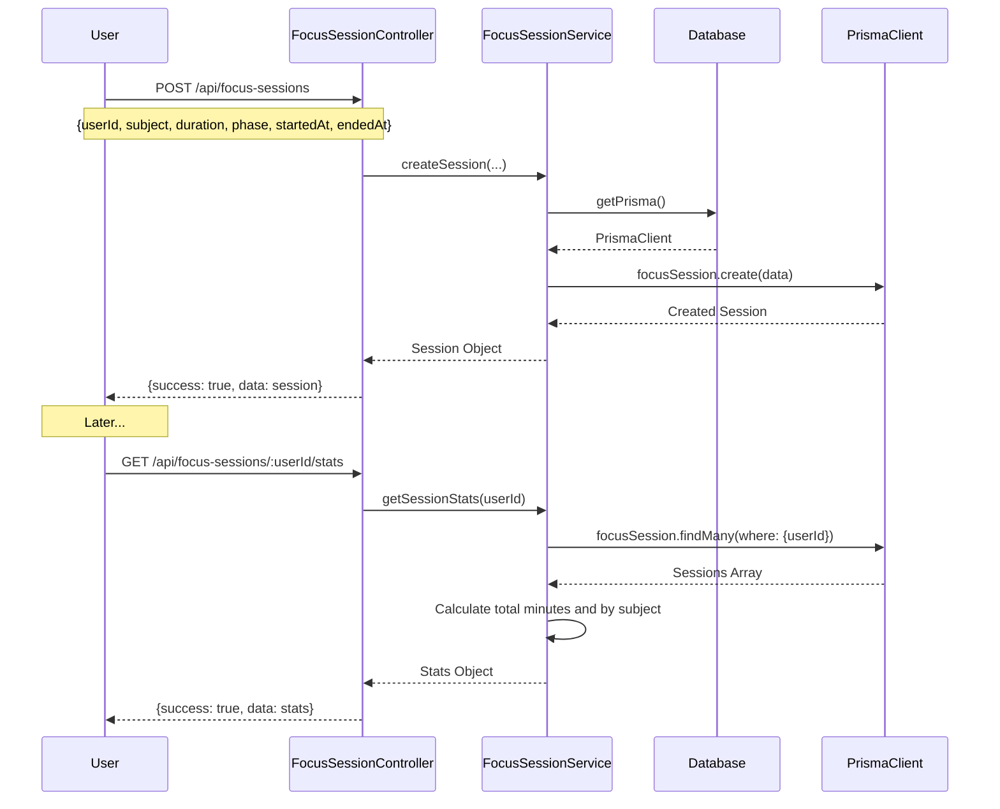
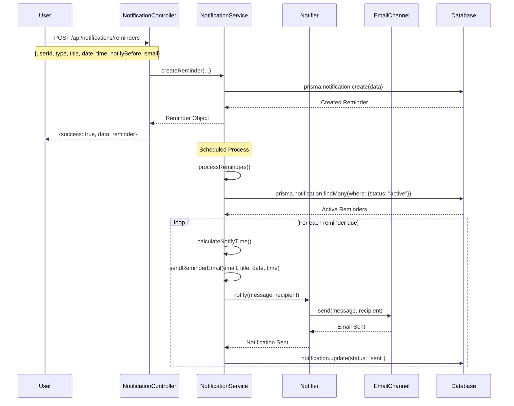
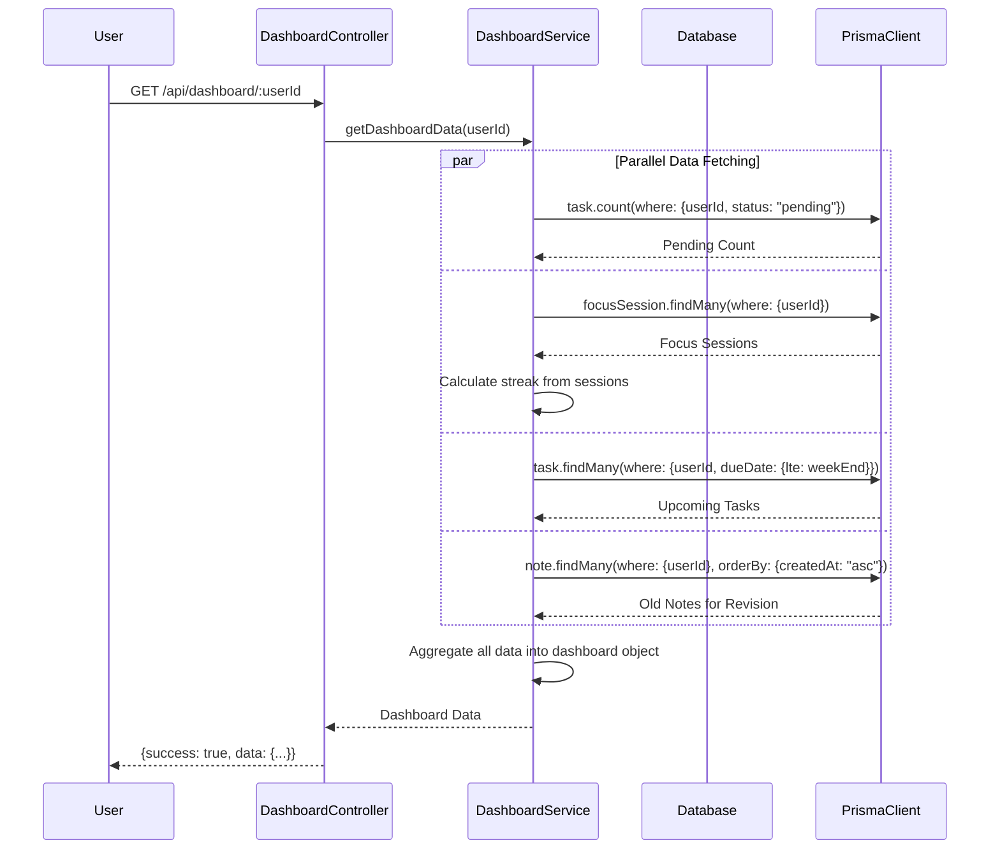

# Sequence Diagram - NexaProductivity

## Task Creation Flow

```mermaid
sequenceDiagram
    participant User
    participant Controller as TaskController
    participant Service as TaskService
    participant Factory as ItemFactory
    participant Pipeline as TaskPipeline
    participant DB as Database
    participant Prisma as PrismaClient

    User->>Controller: POST /api/tasks
    Note over User,Controller: {userId, title, priority}
    
    Controller->>Service: createTask(userId, title, priority)
    Service->>Factory: createItem("TASK", userId, data)
    Factory->>Factory: Generate UUID
    Factory-->>Service: Task Object
    
    Service->>Pipeline: execute(task)
    
    rect rgb(240, 240, 240)
        Note over Pipeline: Template Method Pattern
        Pipeline->>Pipeline: fetchContext()
        Pipeline->>Pipeline: processLogic()
        Pipeline->>Pipeline: persist(task)
        Pipeline->>DB: getPrisma()
        DB-->>Pipeline: PrismaClient
        Pipeline->>Prisma: task.create(data)
        Prisma-->>Pipeline: Created Task
    end
    
    Pipeline-->>Service: Execution Complete
    Service-->>Controller: Task Object
    Controller-->>User: {success: true, data: task}
```

## Focus Session Creation and Analytics Flow

```mermaid
sequenceDiagram
    participant User
    participant Controller as FocusSessionController
    participant Service as FocusSessionService
    participant DB as Database
    participant Prisma as PrismaClient

    User->>Controller: POST /api/focus-sessions
    Note over User,Controller: {userId, subject, duration, phase, startedAt, endedAt}
    
    Controller->>Service: createSession(...)
    Service->>DB: getPrisma()
    DB-->>Service: PrismaClient
    Service->>Prisma: focusSession.create(data)
    Prisma-->>Service: Created Session
    Service-->>Controller: Session Object
    Controller-->>User: {success: true, data: session}
    
    Note over User: Later...
    
    User->>Controller: GET /api/focus-sessions/:userId/stats
    Controller->>Service: getSessionStats(userId)
    Service->>Prisma: focusSession.findMany(where: {userId})
    Prisma-->>Service: Sessions Array
    Service->>Service: Calculate total minutes and by subject
    Service-->>Controller: Stats Object
    Controller-->>User: {success: true, data: stats}
```

## Notification/Reminder Flow

```mermaid
sequenceDiagram
    participant User
    participant Controller as NotificationController
    participant Service as NotificationService
    participant Notifier
    participant Channel as EmailChannel
    participant DB as Database

    User->>Controller: POST /api/notifications/reminders
    Note over User,Controller: {userId, type, title, date, time, notifyBefore, email}
    
    Controller->>Service: createReminder(...)
    Service->>DB: prisma.notification.create(data)
    DB-->>Service: Created Reminder
    Service-->>Controller: Reminder Object
    Controller-->>User: {success: true, data: reminder}
    
    Note over Service: Scheduled Process
    
    Service->>Service: processReminders()
    Service->>DB: prisma.notification.findMany(where: {status: "active"})
    DB-->>Service: Active Reminders
    
    loop For each reminder due
        Service->>Service: calculateNotifyTime()
        Service->>Service: sendReminderEmail(email, title, date, time)
        Service->>Notifier: notify(message, recipient)
        Notifier->>Channel: send(message, recipient)
        Channel-->>Notifier: Email Sent
        Notifier-->>Service: Notification Sent
        Service->>DB: notification.update(status: "sent")
    end
```

## Dashboard Data Aggregation Flow

```mermaid
sequenceDiagram
    participant User
    participant Controller as DashboardController
    participant Service as DashboardService
    participant DB as Database
    participant Prisma as PrismaClient

    User->>Controller: GET /api/dashboard/:userId
    Controller->>Service: getDashboardData(userId)
    
    par Parallel Data Fetching
        Service->>Prisma: task.count(where: {userId, status: "pending"})
        Prisma-->>Service: Pending Count
    and
        Service->>Prisma: focusSession.findMany(where: {userId})
        Prisma-->>Service: Focus Sessions
        Service->>Service: Calculate streak from sessions
    and
        Service->>Prisma: task.findMany(where: {userId, dueDate: {lte: weekEnd}})
        Prisma-->>Service: Upcoming Tasks
    and
        Service->>Prisma: note.findMany(where: {userId}, orderBy: {createdAt: "asc"})
        Prisma-->>Service: Old Notes for Revision
    end
    
    Service->>Service: Aggregate all data into dashboard object
    Service-->>Controller: Dashboard Data
    Controller-->>User: {success: true, data: {...}}
```
