# Use Case Diagram - NexaProductivity

```mermaid
graph TB
    User((User))
    
    subgraph Task_Management["Task Management Module"]
        UC1[Create Task]
        UC2[View Tasks]
        UC3[Update Task Status]
        UC4[Create Subtask]
        UC5[Set Task Priority]
        UC6[Set Due Date]
    end
    
    subgraph Note_System["Notes System Module"]
        UC7[Create Note]
        UC8[View Notes]
        UC9[Update Note]
        UC10[Track Note Age for Revision]
    end
    
    subgraph Focus_Sessions["Focus Session Module"]
        UC11[Start Focus Session]
        UC12[Track Study Time]
        UC13[View Session History]
        UC14[View Session Statistics]
        UC15[View Weekly Analytics]
    end
    
    subgraph Notifications["Notification Module"]
        UC16[Create Reminder]
        UC17[View Reminders]
        UC18[Delete Reminder]
        UC19[Receive Email Notification]
        UC20[Set Custom Reminder]
    end
    
    subgraph Integrations["Integration Module"]
        UC21[Connect Slack]
        UC22[Connect Outlook]
        UC23[Disconnect Integration]
        UC24[View Connected Services]
        UC25[Sync External Data]
    end
    
    subgraph Dashboard["Dashboard Module"]
        UC26[View Dashboard Stats]
        UC27[View Study Streak]
        UC28[View Upcoming Deadlines]
        UC29[View Revision Topics]
        UC30[View Today Plan]
    end
    
    User --> UC1
    User --> UC2
    User --> UC3
    User --> UC7
    User --> UC8
    User --> UC9
    User --> UC11
    User --> UC13
    User --> UC14
    User --> UC16
    User --> UC17
    User --> UC21
    User --> UC22
    User --> UC26
    
    UC1 -.->|enables| UC4
    UC1 -.->|requires| UC5
    UC1 -.->|optional| UC6
    UC4 -.->|creates| UC1
    
    UC11 -.->|generates| UC12
    UC12 -.->|aggregates to| UC14
    UC12 -.->|aggregates to| UC15
    
    UC1 -.->|triggers| UC16
    UC16 -.->|sends| UC19
    
    UC21 -.->|enables| UC25
    UC22 -.->|enables| UC25
    
    UC2 -.->|feeds| UC26
    UC13 -.->|feeds| UC27
    UC2 -.->|feeds| UC28
    UC8 -.->|feeds| UC29
    
    style User fill:#e1f5ff
    style Task_Management fill:#fff4e6
    style Note_System fill:#e8f5e9
    style Focus_Sessions fill:#f3e5f5
    style Notifications fill:#fff3e0
    style Integrations fill:#e0f2f1
    style Dashboard fill:#fce4ec
```

## Use Case Descriptions

### Task Management Module
- **UC1: Create Task** - User creates a new task with title, priority, and optional due date
- **UC2: View Tasks** - User views all their tasks filtered by status
- **UC3: Update Task Status** - User changes task status (pending, in-progress, completed)
- **UC4: Create Subtask** - User creates a child task under a parent task
- **UC5: Set Task Priority** - User assigns priority level (low, medium, high)
- **UC6: Set Due Date** - User sets a deadline for task completion

### Notes System Module
- **UC7: Create Note** - User creates a new note with title and content
- **UC8: View Notes** - User views all their notes
- **UC9: Update Note** - User edits note title or content
- **UC10: Track Note Age** - System tracks note age for spaced repetition

### Focus Session Module
- **UC11: Start Focus Session** - User starts a Pomodoro-style focus session
- **UC12: Track Study Time** - System records session duration and subject
- **UC13: View Session History** - User views past focus sessions
- **UC14: View Session Statistics** - User views total time and breakdown by subject
- **UC15: View Weekly Analytics** - User views weekly study patterns

### Notification Module
- **UC16: Create Reminder** - User creates a reminder for task or custom event
- **UC17: View Reminders** - User views all active reminders
- **UC18: Delete Reminder** - User removes a reminder
- **UC19: Receive Email Notification** - System sends email at scheduled time
- **UC20: Set Custom Reminder** - User creates non-task-related reminder

### Integration Module
- **UC21: Connect Slack** - User connects their Slack account
- **UC22: Connect Outlook** - User connects their Outlook calendar
- **UC23: Disconnect Integration** - User removes an integration
- **UC24: View Connected Services** - User views all active integrations
- **UC25: Sync External Data** - System syncs data with external services

### Dashboard Module
- **UC26: View Dashboard Stats** - User views key metrics (pending tasks, streak, etc.)
- **UC27: View Study Streak** - User sees consecutive days of study activity
- **UC28: View Upcoming Deadlines** - User sees tasks due soon
- **UC29: View Revision Topics** - User sees notes that need review
- **UC30: View Today Plan** - User sees suggested study schedule

## Actor

**User**: A student or professional using NexaProductivity to manage tasks, track study sessions, take notes, and stay organized.

## Relationships

- **Association** (solid line): Direct interaction between user and use case
- **Include** (dashed arrow): One use case requires another
- **Extend** (dashed arrow): One use case optionally extends another
